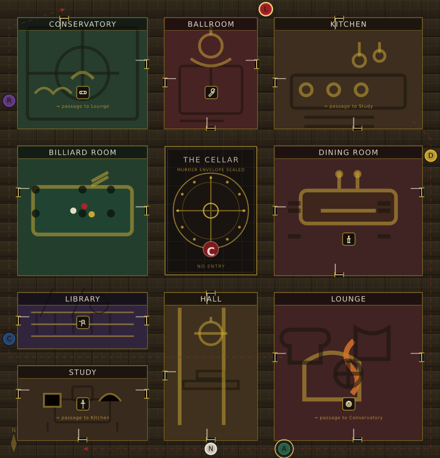

# 🕯 CLUEDO — A 1920s Murder Mystery

A complete, production-grade recreation of the classic murder-mystery board game: **real-time
multiplayer with room codes**, **host-authoritative state with fog-of-war masking**, **autonomous
deduction-driven AI detectives**, an authentically laid-out **24 × 25 mansion grid**, **3D dice
physics**, an **interactive detective notebook** and a **fully procedural Web Audio soundtrack**
(rain, thunder, wooden dice, paper dossiers, brass stingers and a courtroom gavel — zero audio files).

```
 Miss Scarlet moves first. The envelope is already sealed.
 Someone in this house is a murderer, and everyone at the table is lying about their cards.
```

---

## Quick start

```bash
npm install

# development — relay on :8787, Vite dev server on :5173 (proxying /api)
npm run dev

# production — one process serves the built client *and* the relay
npm run build && npm start

# tests (56 of them: board geometry, engine, protocol, AI simulations, UI renders)
npm test
```

Open the app, type a name, **sit at your own table** and share the four-letter room code. A second
browser tab (or another machine on the network) enters that code and is seated as a separate
detective. Down to playing alone? **Add AI detectives** from the lobby and the case will play itself
out around you.

> If the relay is unreachable the client silently falls back to a private offline table — the whole
> game (rules, AI, audio, dice) runs in the browser with no server at all.

---

## What's implemented



### The mansion — an authentic 24 × 25 grid

Nine rooms on a double racetrack of hallways that runs the full perimeter (where the six suspects
spawn) plus an inner loop that wraps the sealed **Cellar vault** in the dead centre.

| Room | Placement | Doorways | Secret passage |
|---|---|---|---|
| Conservatory | top-left | north + east | ⇄ Lounge |
| Ballroom | top-centre | west + east + south | — |
| Kitchen | top-right | north + west + south | ⇄ Study |
| Billiard Room | middle-left | west + east | — |
| Dining Room | middle-right | east + west + south | — |
| Library | lower-left | west + east | — |
| Hall | bottom-centre | north + west + south | — |
| Lounge | bottom-right | east + west + south | ⇄ Conservatory |
| Study | bottom-left | west + east + south | ⇄ Kitchen |
| **The Cellar** | centre 5 × 7 | none — permanently sealed | holds the murder envelope |

Perimeter spawns are exactly as specified: Miss Scarlet `(16,0)`, Colonel Mustard `(23,7)`,
Mrs. White `(9,24)`, Mr. Green `(14,24)`, Mrs. Peacock `(0,18)`, Professor Plum `(0,5)`.

### Rules engine (`shared/engine.ts`)

* One suspect, one weapon and one room are sealed into the confidential envelope; the remaining 18
  cards are dealt as evenly as the rules allow.
* Miss Scarlet always moves first, then clockwise around the table.
* **Roll** 2d6 → **Move** by BFS up to the exact pip count → **Suggest** from inside a room →
  **Disprove** clockwise from your left → optional **Accuse** → **End turn**.
* Movement: no diagonals, no walls, no walking *through* the sealed cellar, no sharing an occupied
  hallway tile (rooms may hold any number of tokens), and stepping onto a doorway costs one pip and
  deposits the token inside.
* Suggestions teleport the named suspect's pawn *and* the weapon into the room — a real, visible
  consequence that can hand another detective a free position.
* Disproval stops at the first detective who holds a matching card; that detective privately chooses
  which card to show. Everyone else sees only *"X proved the theory false to Y"*.
* An unrefuted theory raises a breakthrough modal explaining the deduction — *any of those three
  cards not in your own hand must be in the envelope* — with a **one-click final accusation** when
  all three are provably sealed away.
* A wrong final accusation eliminates the detective into a witness: no more rolling or suggesting,
  but their cards stay in play and they must still answer everyone else's queries.
* Secret passages replace the dice roll entirely.

### Host-authoritative sync with fog-of-war (`shared/engine.ts → maskState`)

The tab that created the room owns the **only** copy of the true state. Before anything leaves it,
a pure masking transform runs:

| Secret | What the host keeps | What a client receives |
|---|---|---|
| Other hands | the 18 card ids | `cardCount` only |
| The envelope | three sealed cards | `null` until the case closes |
| A disproved card | the card id | the suggester and the disprover get the card; everyone else gets a boolean flag |
| Disprove prompts | who must answer | only that detective's client |
| Private log lines | per-player entries | filtered by `visibleTo` |

Dismissed modals are recorded **per player** and travel with the action log, so a re-broadcast or a
late packet can never reopen a dialog someone has already closed. Dramatic reveals are sorted ahead
of paperwork, so a player who never closed their dealt hand still sees the case crack open.

### Transport (`server/index.ts`, `client/src/net/transport.ts`)

* **WebSocket** relay (`/api/ws?code=…&peer=…&role=host|client`) carrying opaque, already-masked
  envelopes. The relay never sees a card.
* **HTTP long-poll fallback** (`/api/relay/:code`) for networks that strip upgrades — identical
  message shape, so the sync layer never knows which one is carrying it.
* Room registry (`/api/room/:code/exists`) decides whether a tab hosts or joins.
* Intents are stamped with the *connection's* peer id, and the host refuses any action whose payload
  claims a different player — a client can never act on another detective's behalf.
* While one of your own intents is in flight, private-only edits (notebook, scratchpad, dismissals)
  are predicted locally and merged past the host's slightly older echo.

### AI detectives (`shared/ai.ts`, `shared/deduction.ts`)

Bots are **fair players**: they reason only from their own hand, the cards shown to them, and the
public record of who passed on what. A test asserts they never believe something about a hand that
couldn't be deduced from that information.

* **Goal-driven movement** — one reverse flood-fill from every unexplored room's doorways scores each
  candidate move, so they walk purposefully toward the rooms that still need investigating instead of
  bouncing down corridors. They take secret passages when it opens fresh ground.
* **Deduction memory** — public passes are recorded per detective, which lets a bot prove a card is
  in the envelope once every other player has been shown not to hold it.
* **Suggestions** prefer items nobody has asked about yet, and never repeat a trio they've already
  put to the table unless there's nothing new left to ask.
* **Accusations** are only made when the solution is certain, or when an unrefuted theory proved all
  three cards are sealed away. A very late gambit keeps the case from going cold forever.
* **Smooth pacing** — the host drives bots on an 800–1200 ms cadence so humans watch every roll,
  step, suggestion and disproval land in real time.

**Measured behaviour** (from `npm test`, 20 seeded all-bot games):

```
· 20 games: avg 30–33 turns, 15–18 won by deduction, ~600 suggestions,
  ~1750 disprovals, ~90 secret passages, 3–15 eliminations
```

### Presentation

* **Board** — one hand-built SVG at `viewBox="0 0 24 25"`, so one SVG unit *is* one tile and the
  engine's computed paths plot directly. Every room has its own fittings (glasshouse mullions,
  ballroom chandelier, cast-iron range, baize table with pockets, banquet table, bookshelves, grand
  staircase, fireplace, typewriter desk), the cellar is a riveted iron door under a wax seal, and the
  six weapons are drawn as vector glyphs.
* **3D dice** — gravity, restitution, friction and quaternion angular integration on a canvas, with
  painter-sorted cube faces and affine pip mapping; the dice ease into exactly the orientation that
  shows the value the authoritative engine rolled.
* **Detective notebook** — a slide-out leather-and-parchment clue sheet with ✓ / ? / ✗ rubber stamps,
  automatic ink-sound marking of everything provably known, a "still unaccounted for" tally and a
  typewriter scratchpad that auto-saves.
* **Investigation ledger** — a live, monospaced account of every roll, step, entry, theory and
  disproval, with private lines marked as such.
* **Accusation Inspection Vault** — a cinematic picker for the final accusation, and a reveal modal
  of three wax-sealed folders opening on the truth.
* **Atmosphere** — rain on the windowpanes, amber gas-lamp flicker, film grain, vignette, Art Deco
  gold rules, crimson velvet accents, Playfair Display over Cormorant Garamond.

### Procedural audio (`client/src/audio/audio.ts`)

Pure Web Audio synthesis, no files: a filtered noise rain bed with LFO gusts and random raindrops,
distant thunder (low-passed brown noise plus a crack), nine-hit wooden dice tumble with body
resonance, dossier shuffles, card-deal whooshes, wax-seal snaps, ink scratches, rubber stamps,
typewriter keys, minor-triad brass stingers through a generated impulse reverb, a three-strike
courtroom gavel and a fanfare for a solved case.

---

## Project layout

```
shared/            runs identically on the host, the AI and the tests
  constants.ts     cards, suspects, rooms, weapons, spawns, palette
  board.ts         tile classification, walkable graph, BFS, doorway flood-fill, token paths
  engine.ts        pure reducer: setup, phases, suggestions, disprovals, accusations, masking
  deduction.ts     public-record deduction engine (powers bots, hints and notebook marks)
  ai.ts            bot brain: movement, suggestions, disprovals, accusations
client/src/
  store/gameStore.ts   host authority, masking, bot driver, lag compensation
  net/transport.ts     WebSocket with HTTP long-poll fallback
  audio/audio.ts       procedural noir synthesis
  components/          Board, DiceCanvas, CommandBar, Notebook, Ledger, Modals, boardArt
  screens/             Home, Lobby, GameScreen
server/index.ts    relay: WebSocket + long-poll + room registry + static client
tests/             board · engine · sync · store · AI simulations · UI renders
```

## The rules, in one breath

Roll 2d6 and walk the mansion; step into a room and name a suspect, a weapon and *that* room. Every
other detective, clockwise from your left, must privately show you a matching card if they hold one —
and the moment one does, the query stops. Mark what you learn in your notebook. When you can name the
murderer, the weapon and the room with certainty, make your final accusation: be right and the case
is yours, be wrong and you spend the rest of the night as a witness.

---

*Built with React 18, Vite, TypeScript and `ws`. No game-engine dependencies, no audio files, no
image assets — the mansion, the dice and the soundtrack are all generated.*
